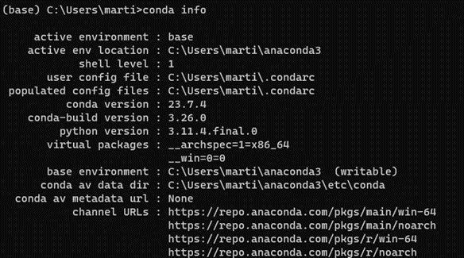
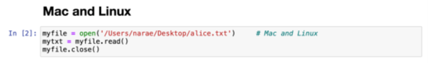
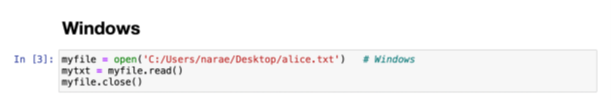

# The Internship Network in the Mathematical Sciences
## Workshop #1 - Introduction to Python and its Scientific Software Stack
This material is part of the INMAS training Workshop Series.
This repository contains the learning material and the exercise Notebooks that are part of the Workshop.

The convention used to name the notebooks is as follows:
- **N-files** present the material to learn in Jupyter notebooks and use the RISE extension for viewing them
- **X-Files** contain exercises associated with the material notebook with the same sequence number and name. These exercises are meant to be solved using Jupyter, with the assistance of a command line terminal for some exercises.  Exercise notebooks
are not written with the RISE extension, except for the first one (00). They are meant to be completed by the student in normal viewing mode.
- **Z-files** contain the solutions to the exercises. For obvious reasons, they are distributed separately from the *N-* and *X-* files.

All notebooks are anticipated to be read with the *classic* Jupyter Notebook, i.e., not JupyterLab nor Google's Colab.
This is because the RISE extension is still not either functional or fully debugged on these other platforms.

This Workshop is a basic introduction to Scientific Python which lays the
foundations required for the rest of the INMAS program.
Python has been selected as a language of choice due to its ubiquitous use in the industry and the reduced time, compared to other popular languages, for developing a prototype application.
This is mainly thanks to the broad availibility of modules that were developed for the language, allowing to interface with many other programming languages (e.g., C), applications (e.g., Excel), and interfaces (e.g., the web or the operating system).

This workshop is aimed at beginner students as well as students with more advanced proficiency in Python.
The material in this workshop is adjusted so that students with different levels of
proficiency can each learn and be challenged.
This is achieved by interweaving more advanced concepts with simple ones,
and providing more advanced, optional exercices for the most proficient students.

We anticipate that students will have sufficient time to assimilate the core parts of the training during the Workshop.
We suggest students revisit these notebooks at a later time.
This will help assimilating the material and ensure a continuity in practicing a new programming language.

The Workshop is structured in 6 parts as follows:

| *Learning Block* | *Notebooks* |  *Exercises and Projects* |
| ---------| --------------------------|  ---|
| **1. Introduction to Python** | 00 to 03 | Exercises 00 to 03|
| **2. Python Fundamentals** | 04 to 09 | Exercises 04 to 08 and Mini-Project 09 |
| **3. Intermediate Concepts** | 10 to 13 | Exercises 10 to 13 |
| **4. Scientific Python** | 14 to 19 | Exercises 14 to 19 |
| **5. Additional Topics** | 20 to 23 | Exercises 21 to 23 and Mini-Project 20 |
| **6. Final Project** | 24 | Project 24 |

### Credits
A first version of this course was developed by Emily Shinkle, Shinhae Park, Adriana Morales Miranda,
Luke Leisman, Martin Lacasse, and many teaching assistants (TAs) who have provided valuable feedback and improvements.
Current version is the result of a significant overhaul done by Martin Lacasse in 2024,
reorganizing, adding, and removing material and exercises,
and restructuring the workshop to be more adaptable to the students' and instructors' needs.
This includes using the material for individual learning, as well as for standard or flipped classroom approaches.

While a good fraction of the modules have original content, some material
was taken, borrowed, inspired, from the following open-source projects:
- For material in the Primers modules
	- [Software Carpentry](https://software-carpentry.org)
	- [Notebook Community](notebook.community)
- For basic I/O
	- [Joseph Santarcangelo](https://colab.research.google.com/github/computationalcore/introduction-to-python/blob/master/notebooks/4-files/PY0101EN-4-1-ReadFile.ipynb#scrollTo=f2BMjBjox2_-)
- For Primers material, functions and methods, I/O, and NumPy, SciPy
	- [JR Johansson](https://github.com/jrjohansson/scientific-python-lectures)
- Debugging
	- [Spiro Sideris](https://github.com/spiside/pdb-tutorial)
- Scientific Python
    - [Fedor Iskhakov](https://github.com/fediskhakov/CompEcon)
- OpenAI
    - [Kie Codes](https://github.com/kiecodes)

-----------------------------------
# Anaconda Starter
The material for this workshop relies on using Jupyter notebooks. We will first describe how to get a proper installation of Anaconda, an open-source package manager and Python distribution that includes a suite of useful packages (in addition to basic Python) pre-installed, as well as package management tools. Anaconda provides an easy way to install additional Python packages that you might need in addition to the most popular packages. Don't worry however: most if not all Python packages needed for the first workshop are included in the default distribution.

## Introduction

[Anaconda](http://anaconda.com) is an open-source distribution of Python (and R, another programming language) bundled with a suite of useful packages, a package manager, and other utility tools. The included Jupyter Notebook reader provides an interactive environment similar to Mathematica or MATLAB. This learning environment is an excellent tool to assimilate the INMAS educational content interactively, and at one's own pace.

In this brief tutorial we will show how to install Anaconda, how to verify a proper installation, and how to run the first Jupyter notebook required for Workshop #1.

Note: If you already have a preferred Python setup that allows you to run a Jupyter notebook, we recommend that you use the latest version of Anaconda as many packages might have evolved since the version you have and may not be compatible with the notebooks we developed.

## Installation

Installation of Anaconda is relatively straightforward, just go to this [link](http://anaconda.com/), and click the download icon

which should automatically detect your operating system. Else, you could look for the _Anaconda installers_ box at the bottom of the web page. At the time of this writing, the latest version is Anaconda 23.7.4 or 2023.07.2 using Python 3.11.

There will be a few installation steps to click through - you can generally use the defaults. For detailed instructions, here are the particular OS installation guides:

- [Windows computers](https://docs.anaconda.com/free/anaconda/install/windows/)
- [MacOS](https://docs.anaconda.com/free/anaconda/install/mac-os/)
- [Linux](https://docs.anaconda.com/free/anaconda/install/linux/)

### Upgrade

If you already have a version of Anaconda installed, it is recommended that you upgrade it to the latest version. The simplest way to update is to uninstall your current version of Anaconda and start with a fresh install as described above, as updating using conda will not update your version of Python but rather will require the creation of a whole new environment based on the newer Python version. On Windows, uninstall the Anaconda application. On MacOS and Linux you can use anaconda-clean, or (not recommended) delete the entire anaconda3 directory located in you home directory before proceeding with a fresh install. If you would rather prefer to keep your existing Python installation, you can certainly do that, with the caveat that you might experience compatibility issues.

## Testing your Anaconda installation

Checking the version of Anaconda and Python is relatively simple. First, open a terminal (shell) window (anaconda Prompt on Windows, Terminal on MacOS and Linux – more details below) and just type:

`conda info`

You should then get something like this:

Make sure that the versions of both Python and *conda* are near the latest versions. At the time of this writing, conda version is 24.9.0 with Python being 3.11.7.final.
The command

`conda list`

will list all the packages installed on your computer and their version numbers. Notice that the packages contain matplotlib, numpy, pandas, and seaborn packages that we will learn about and use during the training.
A successful installation should have a large number of packages available (including those mentioned) and should have the proper versions listed above.

## Opening the Anaconda Navigator

Following a successful installation, you should be able to open the Anaconda navigator.

### Windows computers

Click on the Windows Icon and search through the applications installed on your computer and open via the Anaconda Icon, which should look like this icon. Alternatively, you can type *anaconda-navigator* in the search tool located in the task bar (notice that, by default, searching in Windows is not case sensitive).

### MacOS

Open your Finder and go to the *Applications* Folder, look for *Anaconda-Navigator*, with the same icon you see above.

### Linux

Open a terminal window and type *anaconda-navigator*. Those of you eager to learn Linux in the comfort of your Windows laptop should consider running the *Windows Subsystem for Linux* (WSL) available for free. This will allow you to run a full version of Linux (e.g., Ubuntu) within your Windows operating system. Really cool. More info [here](https://learn.microsoft.com/en-us/windows/wsl/install).

Upon successfully opening the navigator you should see something resembling the following window. Be patient, it sometimes takes a while to load.

The navigator can be used to start many applications. Those of interest to us are mainly the Jupyter Notebook reader and a terminal shell. The advantage of starting a command shell from the navigator is that all the environment variables are already pre-configured for Python. On Windows, we recommend using the PowerShell Prompt over CMD, as the former provides command line editing and history and is therefore more user friendly.

## Downloading the notebooks

The notebooks for the Workshop are available from github (right where you now are :-). You can download the material for the workshop at:

[https://github.com/INMAS-Math/Workshop-V-01.git](https://github.com/INMAS-Math/Workshop-V-01.git)

Click on the code icon to get a zip file containing all the material. Alternatively, you can use a command line and `git` to clone the code as follows:

`git download https://github.com/INMAS-Math/Workshop-V-01.git`

Note that if you were a contributor to the code, you would use `clone` instead of download. This would transfer all the metadata to your computer and allow you to push changes that you make to the code. 

If not already present on your computer, the `git` source code management tool (SCM) can be downloaded and installed from [git-scm.com](https://git-scm.com).

## Opening and running a Jupyter notebook

Start the anaconda navigator and launch the Jupyter Notebook interpreter by clicking on the Launch button of the icon shown here.

The Jupyter Notebook interpreter will start a virtual web server on your computer (localhost) that will be visualized through your default web browser.

The opening page will show the files on your computer. By clicking on the directories, navigate to where you saved the notebooks from Workshop-01 of INMAS. As before, '..' stands for returning to the parent directory. Note that unlike other navigators (e.g., Explorer) a single click is necessary to open a directory.

Jupyter notebooks end with the *.ipynb* file extension. Clicking on the desired file will open the Jupyter Notebook interpreter of that file in a different tab of your browser. These notebooks contain intructions as well as code that can be edited and run. Boxes starting with the *In [  ]* keyword are called *code cells*; they are a block of Python code input waiting to be run. Other boxes, called *markdown cells*, are meant to give instructions. The number between brackets keeps track of the instruction numbers, showing the sequence of the instructions that were run, possibly out of order. A cell generating output will have an *Out[  ]* with an associated sequence number in the brackets. An entire notebook can be reset by restarting the kernel and clearing all output and the state of all variables. This is done through selecting *Restart and Clear Output* under the *Kernel* tab.

To run a block of code, click on the box and the surrounding perimeter of that box will turn green, indicating that it is ready to run with hitting *Crtl-Enter*. Alternatively, *Shift-Enter* will achieve the same result, except that the mouse focus will jump to the next cell. Double-clicking on a markdown cell will switch the cell to the editing mode and show the raw (markdown) code for the text. Running the cell (*Ctrl-Enter*) will (re-)generate the nice text. Code cells, on the other end, can be edited directly once the mouse focus is on that cell (i.e., there is no need to double-click to edit those cells).

The menu at the top of the page contains the main commands and will indicate the type of cell where the mouse is focusing. Clicking on run is another way to run the current cell, equivalent to *Shift-Enter*. It is also possible to run all the cells in the notebook by selecting *Run All* under the *Cell* heading. Notice all the shortcuts indicated in these menus, providing a keyboard alternative. Moreover, the *Help* tab contains a *User Interface Tour*, as well as reference to the Python langage and its most popular packages such as pandas and NumPy, for example. Use these references if needed. You should minimally read the *User Interface Tour* if you are new to Jupyter Notebook.

## Additional considerations on Windows Computers

On recent versions of Windows (e.g., version 11), *Controlled folder acces* might deny access to Python, resulting in the autosave feature of Jupyter Notebook reader to be broken. If you receive a message in Jupyter Notebook stating that the file you are using does not exist, the *Controlled folder access* feature of Windows is probably enabled and is prohibiting *python.exe* to write to the directory. To fix, open *Windows Security* -\> *virus and threat protection* -\> *virus and threat settings* -\> *Controlled folder access* -\> *Manage Controlled folder access* -\> *Allow an app through Controlled folder access* -\> (click yes) -\> *Add an allowed app* -\> *Recently blocked app* -\> *+add python.exe*. Alternatively, you can disable *Control access folder* for the duration of the training.

## A Note on File Paths in Python

File paths have a different dialect depending on the operating system that you are using. In Linux and MacOS, all file paths start from the root directory which is referred to by "/". Each level of subdirectory from there is separated by an additional "/". For example:

Reference to a directory starting with "/" is called an absolute reference. In other instances, it can start from where you are located (your current working directory), being without a leading "/". This is the case for the parent directory "../" for example. These are relative paths.

In Windows, an absolute reference starts with the disk letter followed by a colon (e.g., C:, D:, etc). For example, "C:\Users\jane\Documents\somefile.txt".

You can lookup a file's full path and file name through its "properties":

- On Windows computers, right click on the file name in the file explorer and click *Properties* (alternatively, *Alt-Enter* after highlighting the filename). For a file called "myfile.py" in directory "C:\Users\jane\Documents\scripts", the full path in Python would need to be "C:\Users\jane\Documents\scripts\myfile.py".
- On MacOS, right-click on the file and select *Get Info*. Alternatively, *Command + i* brings up the *Get Info* panel. Using the same example, the full path in Python would need to be entered as "/Users/jane/Documents/scripts/myfile.py".

Python, however, allows the usage of '/' on Windows, for portability reasons. Therefore, the path in the following example is perfectly valid. We recommend that you use forward slashes '/' over backslashes '\' when using Python on Windows. Another reason to use a forward slash is that the backslash character is an escape character when used inside a string (a dialect inherited from the C programming language).

## Navigating using a command shell

It is sometimes easier to use command line interface over a graphical user interface. Starting a terminal can be done through the Anaconda Navigator, or through starting a terminal on Mac or Linux. Navigating files and directories consists of using the following five basic commands:

- `ls` or `dir` list files in current directory
- `cd` change current directory
- `pwd` print working directory
- `mkdir` make a new directory
- `rmdir` remove a directory

Note that when navigating, '.' means the current directory, and '..' means the parent directory. Therefore,

`cd .`

is a null operator, while

`cd ..`

moves to the parent directory. Please take a moment to navigate around the directory tree of your computer and familiarize yourself with these commands.

Help on any of these commands can be obtained by typing, for the command `ls`, for example,

`man ls`

where man stands for manual.

Files can be copied (`cp`), moved (`mv`), or deleted (`rm`). Use `man` to get more information on these commands. Be cautious with the `rm` command as it does not ask for a confirmation of the deletion by default.

Using a command line interface is often the preferred method for navigating directories, or projects with multiple files, especially when one is using a version control system such as `git`.
